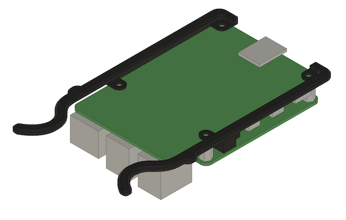

# 3D Printed Parts

## Printing Suggestions

| Filename | Quantity | Suggested Material |
|-|-|-|
| Case.stl | 1 | PLA (for rigidity) |
| LeftCaddy.stl | 4 (1 for each RPi) | PETG (for flexibility) |
| RigthCaddy.stl | 4 (1 for each RPi) | PETG (for flexibility) |
| BaseCaddyHousing.stl | 0, this is a test piece | N/A |

Each part has already been arranged with the appropriate surface facing the
bed.  I would not recommend rotating any part to be on a different print
surface.

## Assembly

**LeftCaddy.stl, RightCaddy.stl:** Using the screws included with the POE Hat,
secure the left and right caddy component to the bottom side of the pi with the
print surface touching the board.

**Case.stl:** Start by attaching the panel mount ethernet extension to the back
of the case as shown below.  After this, slide the POE switch in to place using
the provided hooks and slide each RPi in to their given slot.  Once everything
is in place you can connect all your ethernet cables and route as necessary to
give it a clean look.  At any point you can install the rubber feet provided
with the POE switch to the bottom of the case.

After everything has been assembled in to place, I'd recommend crimping some
custom length cables for them to keep everything looking nice and clean.  I
recommend around 5-6 inch long cables.

